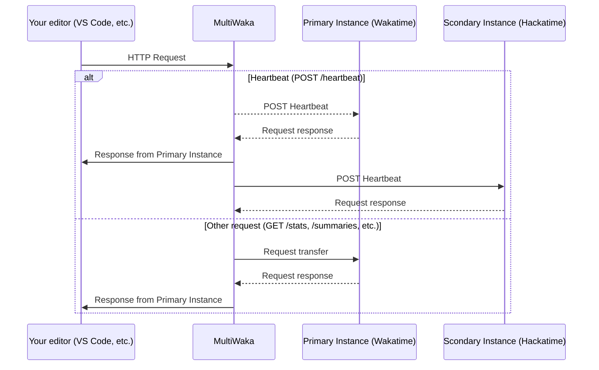

# Multi Waka
This project allows you to use two instances of Wakatime at once. It's particularly useful for me to be able to participate to HackClub's challenges while still be able to use Wakatime.

## How does it work?


## Installation instructions
### Docker (recommended)
Download the compose file
```shell
curl https://raw.githubusercontent.com/Nonolanlan1007/multiwaka/refs/heads/master/docker-compose.yml
```
Update the environnement variables in `docker-compose.yml` and then update your `.wakatime.cfg` :
```cfg
[settings]
api_url = http://127.0.0.1:1234
```
Then restart your IDE and enjoy :)
### Binary
Download the binary for your OS from the [Release page](https://github.com/Nonolanlan1007/multiwaka/releases)
#### MacOS
Add the following content to the file `~/Library/LaunchAgents/com.user.multiwaka.plist`
```xml
<?xml version="1.0" encoding="UTF-8"?>
<!DOCTYPE plist PUBLIC "-//Apple//DTD PLIST 1.0//EN" "[http://www.apple.com/DTDs/PropertyList-1.0.dtd](http://www.apple.com/DTDs/PropertyList-1.0.dtd)">
<plist version="1.0">
<dict>
    <key>Label</key>
    <string>com.user.multiwaka</string>
    <key>ProgramArguments</key>
    <array>
        <string>/path/to/multi_waka/binary</string>
    </array>
    <key>EnvironmentVariables</key>
    <dict>
        <key>WAKASYNC_PORT</key>
        <string>8080</string>
        <key>MULTIWAKA_URL_1</key>
        <string>https://wakatime.com/api/v1</string>
        <key>MULTIWAKA_KEY_1</key>
        <string><!-- YOUR_WAKA_TIME_TOKEN_HERE --></string>
        <key>MULTIWAKA_URL_2</key>
        <string>https://hackatime.hackclub.com/api/hackatime/v1</string>
        <key>MULTIWAKA_KEY_2</key>
        <string><!-- YOUR_HACK_A_TIME_TOKEN_HERE --></string>
        <key>MULTIWAKA_DEBUG</key>
        <string>true</string>
        <key>MULTIWAKA_PORT</key>
        <string>1234</string>
    </dict>
    <key>RunAtLoad</key>
    <true/>
    <key>KeepAlive</key>
    <true/>
    <key>StandardOutPath</key>
    <string>/tmp/multiwaka.log</string>
    <key>StandardErrorPath</key>
    <string>/tmp/multiwaka.err</string>
</dict>
</plist>
```

#### Debian based distros
```toml
[Unit]
Description=MultiWaka Sync Service
After=network.target

[Service]
ExecStart=/path/to/multi_waka/binary

Environment="WAKASYNC_PORT=8080"
Environment="MULTIWAKA_URL_1=https://wakatime.com/api/v1"
Environment="MULTIWAKA_KEY_1=<YOUR_WAKA_TIME_TOKEN_HERE>"
Environment="MULTIWAKA_URL_2=https://hackatime.hackclub.com/api/hackatime/v1"
Environment="MULTIWAKA_KEY_2=<YOUR_HACK_A_TIME_TOKEN_HERE>"
Environment="MULTIWAKA_DEBUG=true"
Environment="MULTIWAKA_PORT=1234"

Restart=always
RestartSec=5

StandardOutput=append:/tmp/multiwaka.log
StandardError=append:/tmp/multiwaka.err

User=<yourusername>
```

#### Windows
You can use [NSSM](https://github.com/dkxce/NSSM)